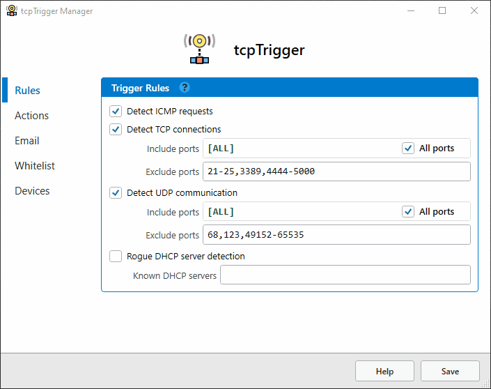

tcpTrigger
==========

tcpTrigger is a Windows service intended to notify you of incoming network connections. You specify what to monitor, and the actions to take when a connection is detected. Actions include: writing to a log, sending a notification email, and launching an external script or application.

##### Settings

Download
--------
**[Click here to download latest .msi installer](https://github.com/R-Smith/tcpTrigger/releases/latest/download/tcpTrigger.Setup.msi)**
##### (1.3.4 released on January 15, 2023)

##### Notes
* .NET 4.5 or greater is required.
* My build environment is Microsoft Visual Studio Community 2022 and WiX Toolset v3.11.2.

Features
--------
New release. Feature list, documentation, and deployment guide coming soon. The application includes built-in documentation.

Screenshots
--------------------
##### Name poison detection example (popup alert)

##### Rogue DHCP server detection example (email alert)

##### Port scan detection example (email alert)

##### Ping detection example (popup alert)

